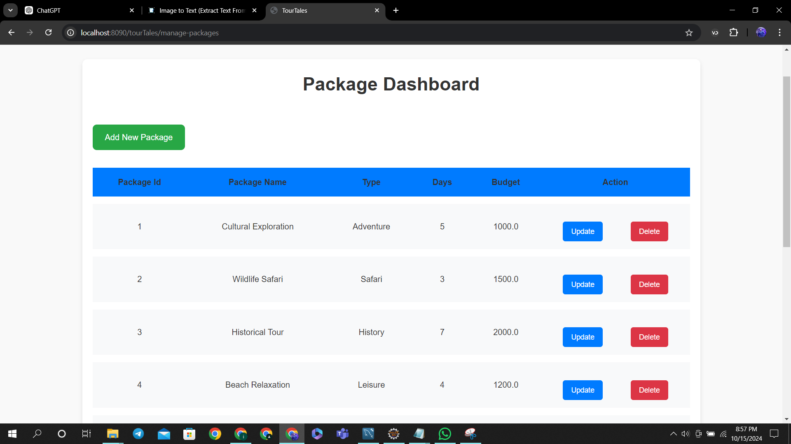
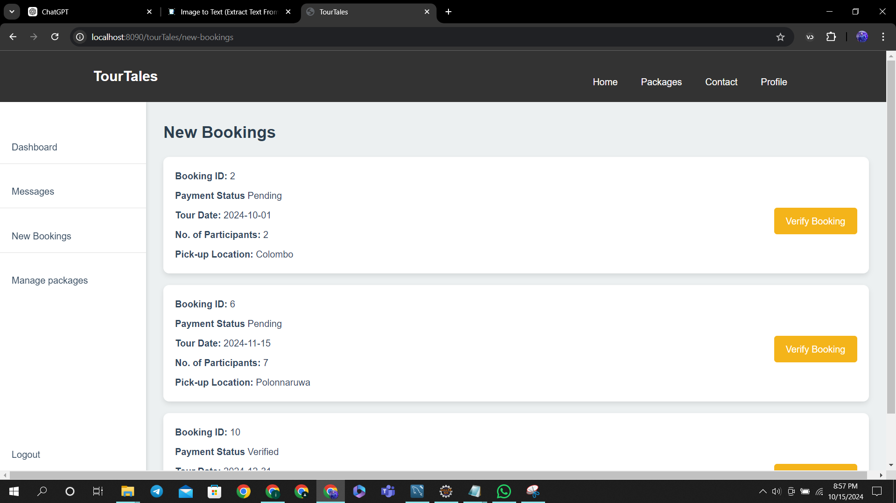
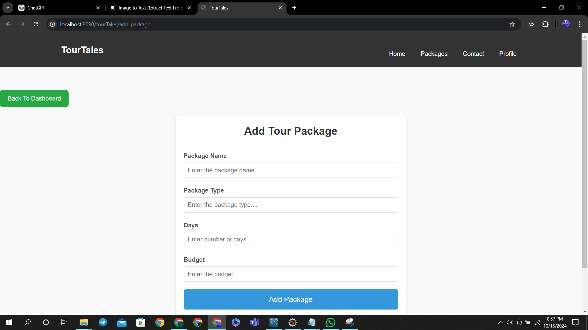

# 🗺️ TourTales – Online Tour Guide System


> **TourTales** is a Java Servlet & JSP-based web application designed to connect customers, tour guides, and administrators in one platform for a smooth tour booking and management experience.

---

## 📌 Table of Contents
- [About](#about)
- [Features](#features)
- [Tech Stack](#tech-stack)
- [Database](#database)
- [Team & Contributions](#team--contributions)
- [Setup & Installation](#setup--installation)
- [Screenshots](#screenshots)
- [License](#license)

---

## 📖 About
**TourTales** provides:
- Hassle-free booking of tours & vehicles
- Real-time communication between customers, guides, and staff
- Package management & payment handling  
All managed via **Java Servlets, JSP, and MySQL**.

---

## ✨ Features

<details>
<summary>🧑‍💼 Admin / Staff</summary>

- Verify new bookings  
- Assign guides to bookings  
- Manage user messages  
- Staff login/signup  
- View all users  
</details>

<details>
<summary>🧑‍🤝‍🧑 Tour Guide</summary>

- Create, update, delete, and view tours  
- Respond to assigned bookings  
- Communicate with customers & staff  
</details>

<details>
<summary>🧑 Customer</summary>

- Create bookings & make payments (Card / Bank Transfer)  
- Update personal profile or delete account  
- View booking history & package details  
</details>

<details>
<summary>💼 Package Management</summary>

- Add, update, delete, and view travel packages  
</details>

<details>
<summary>📩 Messaging System</summary>

- Send & receive messages between staff, guides, and customers  
</details>

---

## 🛠 Tech Stack
| Technology     | Usage |
|----------------|-------|
| **Java Servlets** | Backend logic |
| **JSP** | Dynamic web pages |
| **MySQL** | Database management |
| **Apache Tomcat** | Web server |
| **HTML5, CSS3** | Frontend |
| **JDBC** | Database connectivity |

---

## 🗄 Database
**Database Name:** `tourTales`  

Main tables:
- `User`
- `TourGuide`
- `Staff`
- `Customer`
- `Message`
- `Package`
- `Vehicle`
- `Payment`
- `Booking`
- `Book_Vehicle`
- `VerifyBooking`
- `tourlist`

📂 Full schema & sample data: [`/database/tourTales.sql`](database/tourTales.sql)

---


## 🚀 Setup & Installation

1️⃣ **Clone the repository**
```bash
git clone https://github.com/yourusername/tourTales.git
```

2️⃣ Import into IDE
Open Eclipse or IntelliJ IDEA

Import as a Dynamic Web Project

3️⃣ Setup MySQL Database
source database/tourTales.sql;
Update DB credentials in DBConnection.java & related classes

4️⃣ Deploy on Tomcat

Add project to Tomcat server

Run on http://localhost:8080/tourTales


## 📸 Screenshots

<p align="center">
  
  
  
</p>
<p align="center">
  
  
  
</p>
<p align="center">
  
  
  
</p>


